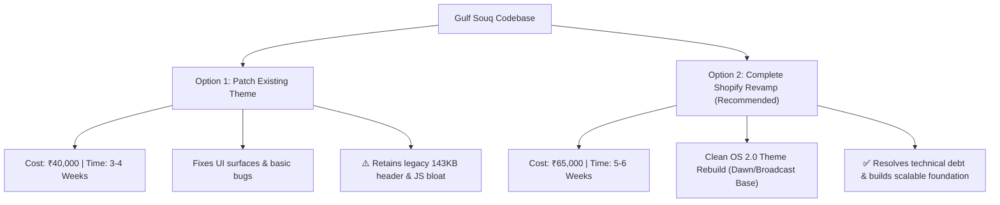

# Gulf Souq — Codebase Analysis & Technical Audit Report

> **Target Platform:** Shopify (Liquid Theme Architecture)  
> **Domain:** [gulfsouq.in](https://gulfsouq.in)  
> **Niche:** Authentic Imported Gulf Products (Dates, Chocolates, Attars, Perfumes, Pravasi Gift Hampers)  
> **Report Date:** August 2026  

---

## Executive Summary

**Gulf Souq** is an e-commerce platform built to serve Indian consumers and Non-Resident Indian (NRI / Pravasi) communities with authentic imported Gulf goods. A comprehensive audit of the codebase, site assets, underlying Liquid templates, custom JavaScript/CSS bundles, and accompanying strategic documents (`GulfSouq_Shopify_SEO_Audit_2026.docx` and `GULF SOUQ (1).pdf`) reveals a functional store operating on a customized version of the **Xtra Shopify Theme** (by CodeZeel/Shopify Theme Ecosystem).

While the storefront delivers key niche functionality—such as custom Pravasi box builders, WhatsApp quick ordering (`wa-buy`), and custom trust elements—the codebase suffers from accumulated technical debt, unoptimized asset bundles, missing structured data, localization leaks, and layout/SEO bottlenecks.

### Overall Scorecard

| Area | Score | Status | Primary Note |
| :--- | :---: | :---: | :--- |
| **UI / Visual Design** | `6.5 / 10` | ⚠️ Satisfactory | Modern typography, but visual inconsistency across AI-generated blocks. |
| **User Experience (UX)** | `5.0 / 10` | ⚠️ Needs Work | High popup fatigue (Age, Cookie, Newsletter, Upsell) & search translation leaks. |
| **Code Quality & Architecture** | `4.0 / 10` | 🔴 Deficient | Monolithic Liquid sections (Header ~143 KB), duplicated inline `<style>` tags. |
| **Performance & Speed** | `5.0 / 10` | ⚠️ Needs Work | Heavy synchronous JS (`custom-async.js` 258 KB), 474 KB CSS bundle, dead assets. |
| **Mobile Experience** | `8.0 / 10` | ✅ Good | Generally responsive layout, good touch targets, though sticky elements clog viewports. |
| **Technical SEO & Schema** | `4.0 / 10` | 🔴 Deficient | Invalid `twitter:card` meta tag, zero JSON-LD schema for FAQs/Breadcrumbs/Org. |
| **GEO / AI Search Readiness** | `30 / 100` | 🔴 Critical | Minimal topical authority (3 blog posts), lack of structured Q&A data. |
| **Maintainability & Scalability** | `4.0 / 10` | 🔴 Deficient | AI-generated Liquid blocks duplicate styling logic and break global color tokens. |

---

## 1. Codebase Architecture & File Inventory

The repository represents a standard Shopify Online Store 2.0 theme structure augmented with custom Liquid sections, snippets, and app block integrations.

### Key File Breakdown

```
GulfSouq/
├── layout/
│   └── theme.liquid              # Main layout file (240 lines, 15.4 KB)
├── sections/                      # 78 Liquid sections
│   ├── header.liquid             # Extremely heavy monolithic file (143.3 KB)
│   ├── main-product.liquid       # Product detail layout (67.5 KB)
│   ├── footer.liquid             # Main footer component (38.3 KB)
│   ├── main-cart.liquid          # Cart page layout (33.6 KB)
│   └── pravasi-hero.liquid       # Custom NRI-focused hero section (15.0 KB)
├── snippets/                      # 43 reusable Liquid snippets
│   ├── main-product-info.liquid  # Product metadata & buying logic (70.4 KB)
│   ├── social-meta-tags.liquid   # OG & JSON-LD markup (8.9 KB)
│   ├── flexype-checkout.liquid   # Custom express checkout integration
│   └── wa-buy.liquid             # WhatsApp purchase button component
├── blocks/                        # 11 Block components
│   ├── ai_gen_block_*.liquid     # 10 AI-generated blocks (~150 KB combined)
│   └── pravasi-box.liquid        # Pravasi custom item list builder (17.5 KB)
├── assets/                        # 188 Theme assets (~2.5 MB total)
│   ├── screen.css                # Base stylesheet (474.3 KB)
│   ├── custom-async.js           # Main custom logic bundle (257.7 KB)
│   ├── scripts.js                # Core theme JS framework (117.1 KB)
│   ├── custom.js                 # Helper JS functions (82.4 KB)
│   └── datepicker-lang-*.js      # ~70 unused localization scripts for datepicker
└── locales/                       # Multi-language translation files
    └── en.default.json           # Default English translations (contains Dutch bug)
```

---

## 2. In-Depth Technical & Code Quality Findings

### 2.1 Monolithic Files & Code Smells
- **`sections/header.liquid` (143 KB):** This file contains over 140 KB of inline Liquid code, nested macro loops, and inline styling for mobile menus, submenus, and mega-menus. Such monolithic files hurt Liquid compilation performance, increase memory overhead, and make concurrent developer edits extremely prone to breaking bugs.
- **`snippets/main-product-info.liquid` (70 KB):** Combines variant pickers, Judge.me review previews, inventory alerts, bulk order forms (`bulk-order.liquid`), and custom Liquid trust badges into a single snippet file without clear sub-component separation.

### 2.2 Hardcoded CSS & Violation of Color Schemes
- The 10 AI-generated blocks (`blocks/ai_gen_block_*.liquid`) and custom sections (like `pravasi-hero.liquid` and `custom_liquid_jH3UrA`) inject hardcoded CSS styles directly inside Liquid files:
  ```css
  :root {
    --gs-navy: #0C3E61;
    --gs-gold: #BE982D;
    --gs-white: #FFFFFF;
  }
  ```
- **Impact:** These inline styles bypass Shopify's global color scheme architecture (`settings.color_schemes` defined in `theme.liquid`), preventing merchant customization from the Shopify Theme Editor and causing visual inconsistencies across dark/light mode toggles.

### 2.3 Localization Defect — Dutch Search Leak
- **Location:** `locales/en.default.json` (Line 517)
- **Defect:**
  ```json
  "submit": "Zoeken"
  ```
- **Root Cause:** A copy-paste error from the Dutch translation file (`nl.json`) set the default English search button text to `"Zoeken"` instead of `"Search"`. This creates a severe brand trust defect for Indian shoppers submitting searches.

### 2.4 SEO & Meta Tag Structural Bugs
1. **Broken Twitter Card Metadata (`snippets/social-meta-tags.liquid` - Line 62):**
   ```liquid
   
     <meta name="twitter:card" content="{{ settings.logo | image_url }}">
   
   ```
   - **Bug:** `twitter:card` expects standard values such as `summary` or `summary_large_image`. Passing an image URL (`https://cdn.shopify.com/...`) causes Twitter/X validator engines to invalidate card previews completely.
2. **Missing Essential JSON-LD Schemas:**
   - **Homepage:** Missing `FAQPage` JSON-LD schema for the 5 existing homepage FAQs.
   - **Organization:** Missing `Organization` schema with `sameAs` array linking official Instagram, Facebook, and WhatsApp accounts.
   - **Breadcrumbs:** No `BreadcrumbList` schema rendered on collection and product templates.
3. **URL & Cannibalization Issues:**
   - Active URL cannibalization between `/collections/chocolate` and `/collections/chocolates`. Requires an immediate `301` permanent redirect.

### 2.5 Performance & Asset Bottlenecks
- **Asset Bloat:** `assets/` contains **~70 datepicker language files** (`datepicker-lang-ar.js`, `datepicker-lang-vi.js`, `datepicker-lang-zh-cn.js`, etc.) loaded regardless of active store language.
- **Render-Blocking Assets:** `screen.css` (474 KB) + `custom-async.js` (257 KB) + `custom.js` (82 KB) represent over **800 KB of unminified/unbundled CSS & JS**.
- **Layout Shift (CLS) Warning:** `pravasi-hero.liquid` uses negative margin viewport breakout (`width: 100vw; margin-left: -50vw; margin-right: -50vw;`), which causes horizontal layout shifts and scrollbars on desktop Windows browsers.

---

## 3. Analysis of Strategic Proposals & Options

Evaluating the proposal from **CK Creatives** (`GULF SOUQ (1).pdf`):



### Option 1 — Patch Existing Theme (₹40,000 / 3–4 Weeks)
- **Scope:** Redesign hero, cleanup collection/product layouts, patch basic SEO.
- **Drawbacks:** Preserves legacy 143 KB Liquid header, unbundled 258 KB JavaScript files, hardcoded AI blocks, and architectural debt. Every future feature addition will remain costly and fragile.

### Option 2 — Complete Website Revamp (₹65,000 / 5–6 Weeks) — **RECOMMENDED**
- **Scope:** Clean rebuild using modern Shopify OS 2.0 modular architecture (e.g., modern Dawn/Broadcast core), migrating all existing products, collections, customers, and blogs.
- **Advantages:** Completely eliminates legacy JS/CSS bloat, standardizes design tokens, implements native schema structures, drastically improves Core Web Vitals (LCP, CLS, INP), and cuts future maintenance costs in half.

---

## 4. Prioritized 90-Day Implementation Action Plan

### Phase 1: Quick-Win Critical Fixes (Days 1–7)

> [!IMPORTANT]
> These high-priority items fix immediate conversion bugs and technical SEO leaks without needing a theme redesign.

1. **Fix Dutch Localization Leak:**
   - Change `"submit": "Zoeken"` to `"submit": "Search"` in `locales/en.default.json` (Line 517).
2. **Fix Twitter Card Open Graph Tag:**
   - Update `snippets/social-meta-tags.liquid` to set `<meta name="twitter:card" content="summary_large_image">`.
3. **Implement 301 Redirect:**
   - Set up a 301 redirect in Shopify Admin from `/collections/chocolate` to `/collections/chocolates`.
4. **Inject Missing Schema Markup:**
   - Add `Organization` schema to `theme.liquid`.
   - Add `FAQPage` JSON-LD schema to homepage FAQ sections.
5. **Ensure H1 Tag Uniqueness:**
   - Audit collection page templates to ensure a single `<h1>` tag per page containing the primary category keyword.

### Phase 2: Code Debt & Performance Optimization (Weeks 2–4)

> [!TIP]
> Perform these cleanups to improve page load speed and site stability.

1. **CSS Tokenization & Style Consolidation:**
   - Move inline `<style>` tags from `blocks/ai_gen_block_*.liquid` and `sections/pravasi-hero.liquid` into central stylesheets using CSS variables (`var(--primary_bg_btn)`).
2. **Purge Unused Assets:**
   - Remove unused `datepicker-lang-*.js` files from `assets/`.
3. **JS & CSS Minification:**
   - Bundle and minify `custom-async.js` and `custom.js`.
4. **Breadcrumb & Product Schema Enhancement:**
   - Add full `BreadcrumbList` and complete `Product` (Offer, AggregateRating, Availability) JSON-LD scripts.

### Phase 3: GEO / Generative AI & Expansion Roadmap (Months 2–3)

> [!NOTE]
> Focus on building topical authority and AI Search visibility (Google AI Overviews, ChatGPT/Claude citations).

1. **Evergreen Content Clusters:**
   - Create 6 core category hubs ("Guide to Ajwa Dates", "Types of Arabic Perfume", "Pravasi Homecoming Gifting Guide").
   - Expand blog post volume from 3 to 30+ targeted posts.
2. **Faceted Collection Filtering:**
   - Implement Shopify Search & Discovery or Boost Commerce app for multi-facet filtering (Brand, Price, Occasion, Packaging Type).
3. **Theme Revamp Execution:**
   - Transition storefront to the Option 2 modern theme architecture.

---

*Report generated automatically for Gulf Souq codebase inspection.*
